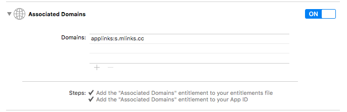
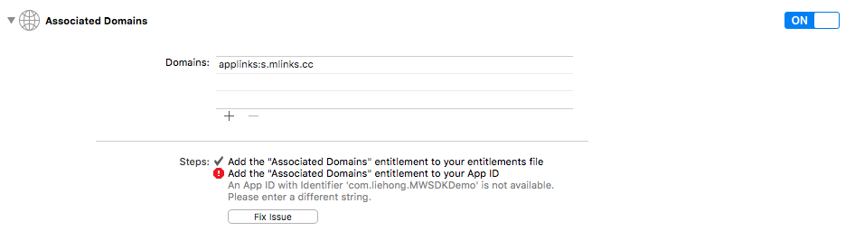
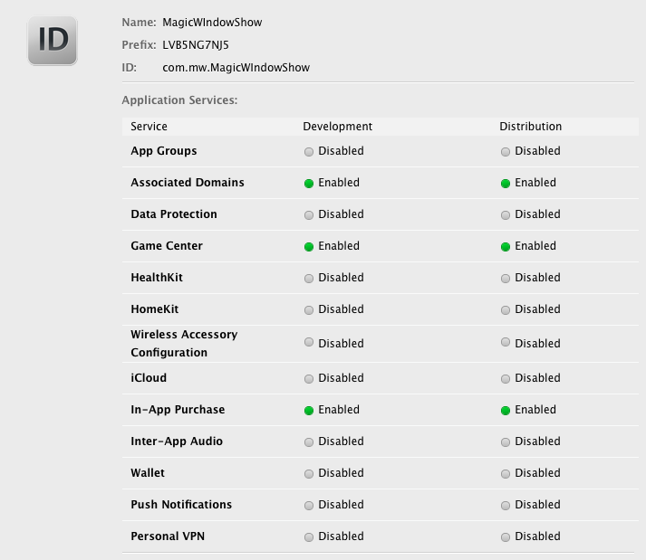

#魔窗iOS SDK FAQ
1.配置好的短链接为何无法从微信跳转到app？
* 确认设备是否是iOS9以上
* 短链接所在的mLink基础配置是否使用了universal link 服务
* app中是否进行了相关universal link的配置
* 确认相关参数是否配置正确

2.短链接所在的mLink基础配置和app都配置了universal link，但是无法从微信跳转到app？
* 确认设备是否是iOS9以上
* 在微信中按照提示，在safari中打开，下拉页面，查看上面是否有打开按钮
如果有打开按钮，点击打开就可以跳转到app，然后再次从微信中点击短链接即可从微信中直接跳转到app
如果没有打开按钮，请确认下面的内容都是填写正确 （applinks:s.mlinks.cc）

3.什么是URL Scheme，怎么配置？
iOS系统中 App之前是相互隔离的，通过URL Scheme，App之间可以相互调用，并且可以传递参数。 
在Xcode中，选中Target－Info－URL Types。比如填写magicWindow
在手机浏览器中输入 URL Scheme:// （比如 magicWindow://），如果可以唤起App，说明该URL Scheme 配置成功

4.在编辑Associated Domains 的时候，报错，错误信息“An App ID with Identifier ‘com.XXX’ is not available”，怎么解决？

* 进入苹果开发者帐号，将当前App ID 的Associated Domains 设置成Enable，如下图

* update 相应的provisioning Profiles
* 重新编译app即可

5.跳转URL怎么对应不同的页面？scheme uri 怎么配置？ 
  这里有iOS比较详细的配置：
http://www.cocoachina.com/industry/20140522/8514.html