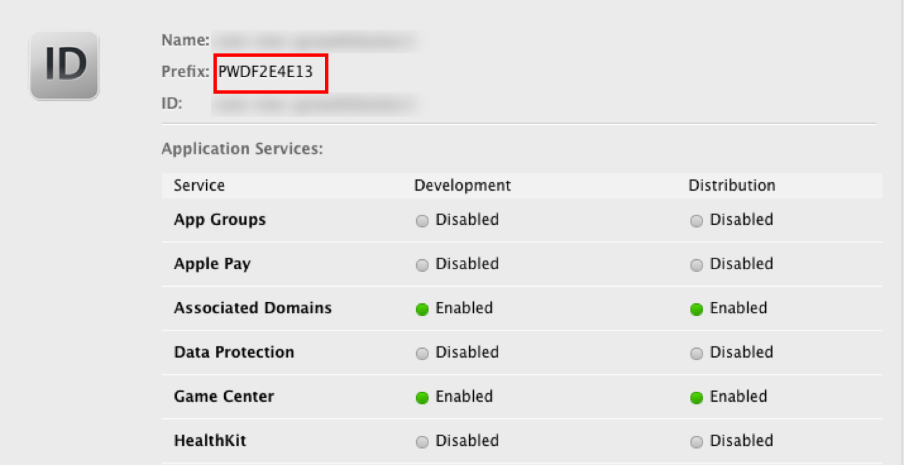
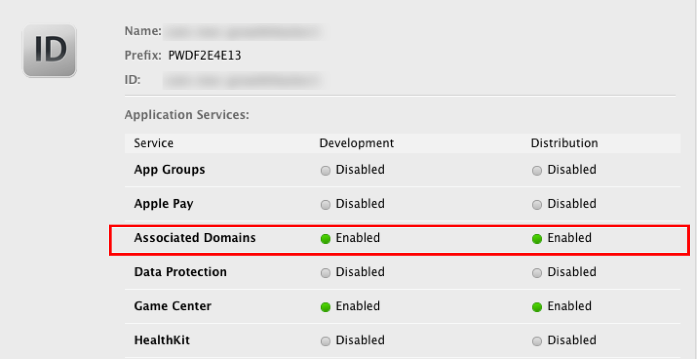
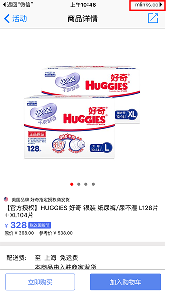

#魔窗iOS SDK FAQ

FAQ分类
---
* [Universal link](https://github.com/magicwindow/mw-sdk-faq/blob/master/ios-sdk-faq.md#universal-link)
  * QA1.mLink和App都配置了Universal link，但是无法从微信跳转到App？
  * QA2.在编辑Associated Domains 的时候，报错，错误信息“An App ID with Identifier ‘com.XXX’ is not available”，怎么解决？
  * QA3.右上角的“mlinks.cc”如何去掉或者更改
* [短链接](https://github.com/magicwindow/mw-sdk-faq/blob/master/ios-sdk-faq.md#短链接)
  * QB1.通过短链进入具体页面后，删除App，重新安装App，依旧进入短链对应的具体页面。
  * QB2.短链内的参数值能动态修改么？
  * QB3.一键唤起成功，场景还原失败
  * QB4.在微信中点击短链接唤起App，在App中收到的动态参数的值不正确
  * QB5.在Debug下测试正常，但是在Release下不能正常一键唤起
  * QB6.手机上在1个小时之内没有点击过短链接，第一次安装出现场景还原
  * QB7.当App在openUrl方法中接收到URL后，如何确认当前的URL来源是魔窗？
  * QB8.在微信中点击短链接，会出现“打开App”的中间页面，如何去掉这个页面？
  * QB9.在iOS9以上，使用短链接唤起App，App接收到链接是"https://s.mlinkscc/xxxx"，而不是短链接或者在后台填写的scheme uri，为什么？
* [应用宝](https://github.com/magicwindow/mw-sdk-faq/blob/master/ios-sdk-faq.md#应用宝)
  * QC1.iOS7、8为什么要开启应用宝跳转？
* [魔窗位](https://github.com/magicwindow/mw-sdk-faq/blob/master/ios-sdk-faq.md#魔窗位)
	* QD1.魔窗位上获取不到活动，error信息"No activities or activities have expired"	
* [app发布](https://github.com/magicwindow/mw-sdk-faq/blob/master/ios-sdk-faq.md#app发布)
  * QE1.App Store提审时，对Advertising Identifier（IDFA）的配置
* [其他](https://github.com/magicwindow/mw-sdk-faq/blob/master/ios-sdk-faq.md#其他)
  * QF1.什么是URL Scheme，怎么配置
  * QF2.微信分享，登录或者支付不能正常使用
  * QF3.手动在工程中添加SDK，初始化SDK的时候出现crash
  * QF4.老版本App没有集成SDK，但是H5中使用了短链接，该怎么处理？

Universal link
===
###QA1.mLink和App都配置了Universal link，但是无法从微信跳转到App？

(1)确认设备系统是iOS9以上,Universal link仅支持iOS9以上

(2)是否被用户手动取消

当使用Universal link打开App之后，右上角会出现“mlinks.cc”,点击右上角会取消Universal link

在Safari中打开链接，按照图中所示下拉页面，会出现smart banner，点击“打开”按钮，Universal link将恢复正常 

(3)Team ID 是否填写正确

如下图，Team ID 和 Prefix正常情况下值都是一样的，当两处的值不一样的时候，优先使用Prefix

(4)自动打包和手动打包

使用xcodebuild自动打包会影响Universal link的使用，请使用手动打包

###QA2.在编辑Associated Domains 的时候，报错，错误信息“An App ID with Identifier ‘com.XXX’ is not available”，怎么解决？

进入苹果开发者帐号，将当前App ID 的Associated Domains 设置成Enable，如下图：

###QA3.右上角的“mlinks.cc”如何去掉或者更改
iOS9+，在微信中唤起app之后，右上角会出现"mlinks.cc"的标记，这个是使用universal link唤起app的标记，和左边的返回标记一样，由系统控制，无法去掉，无法控制。
如果要将"mlinks.cc"字改成自己域名的话，需要自己配置实现universal link，然后在后台的app管理中填写上自己的universal link url即可，mlink还是照常使用。

短链接
===
###QB1.通过短链进入具体页面后，删除App，重现安装App，依旧进入短链对应的具体页面。

程序安装后第一次打开，魔窗mLink会跟后台通信实现场景还原。App清除数据后，mLink会判断程序为第一次安装。此时请求后台并匹配成功。所以会进入具体页面。

用户实际使用时基本不会发生此类情况。属于极小概率事件。

###QB2.短链内的参数值能动态修改么？
可以，短链支持将参数的动态值作为 query 放在后面

例如:http://a.t.mlinks.cc/ANax?id=12345

###QB3.一键唤起成功，场景还原失败
点击短链接的时间和安装App，第一次打开App的时间在60分钟之内，就会场景还原，（默认60分钟，时间可以在后台进行更改）。

点击短链接一键唤起成功的话，场景还原失败的话，需要debug看下，是否受到了App启动页或者引导页的影响。

场景还原和一键唤起的时候，都会走registerMLinkHandlerWithKey:(nonnull NSString *)key handler:(CallBackMLink)handler这个方法。

###QB4.在微信中点击短链接唤起App，在App中收到的动态参数的值不正确

可能是微信缓存造成的，退出微信登录，重新登录微信点击短链接

###QB5.在Debug下测试正常，但是在Release下不能正常一键唤起
(1)后台配置的Team ID是否和App的编译证书相匹配

(2)update 相应的provisioning Profiles

###QB6.手机上在1个小时之内没有点击过短链接，第一次安装出现场景还原
在App之间或者iOS9＋ Safari的跳转都是精准匹配的，不会出现这个情况。

在微信中点击短链接或者其它情况下，我们会根据设备的相关参数来进行模糊匹配，比如IP地址，设备型号，分辨率等等，所以若两个用户在同一wifi环境，完全相同一手机型号时，A用户进行了场景还原，B用户只是去安装，B用户在一小时内可能出现场景还原。

因为在测试阶段，大家都是在同一个wifi下，设备型号和分辨率也相同，所以会出现没有点击短链接也场景还原的情况，但是在实际应用过程中，几乎不会出现两个不相识的用户，有一个用户安装被突然的场景还原。

###QB7.当App在openUrl方法中接收到URL后，如何确认当前的URL来源是魔窗？
魔窗的URL分为两种，一种是scheme，一种是universal link。
universal link的话，有固定的前缀"s.mlinks.cc"
scheme的话，需要开发者自己添加标识，可以在魔窗后台的URI中添加一个参数，类似mw_source=:mw_source 在使用魔窗的服务唤起的时候，h5中设置这个参数为1。

###QB8.在微信中点击短链接，会出现“打开App”的中间页面，如何去掉这个页面？
在H5中加段JS代码就可以去掉这个中间页面，详情见文档：<http://www.magicwindow.cn/doc/mlink-h5.html#begin-start/section-title-2>

###QB9.在iOS9以上，使用短链接唤起App，App接收到链接是“https://s.mlinks.cc/xxxx”,而不是短链接或者在后台填写的scheme uri，为什么？
短链接的样式是 http://a.mlinks.cc/XXXX

iOS9及以上，App接收到的是universal link，https://s.mlinks.cc/XXXX

iOS8以下，App接收到的是后台填写的scheme uri

短链接会根据不同的系统、不同的场景自动解析成universal link或者scheme来唤起App

应用宝
===
###QC1.iOS7、8为什么要开启应用宝跳转？
在iOS7、8的系统中，开启应用宝跳转后可以借助应用宝跳转到AppStore，在AppSore中直接打开应用。开启方法如下： 
1. 登录腾讯开放平台，选择该iOS应用对应的Android版本，选择“运营服务”中的“微下载”，在微下载地址处配置对应的AppStore下载地址。 
2. 将该微下载地址填写到魔窗后台“mLink”菜单下的“高级设置”中，微下载地址的格式为“http://a.app.qq.com/o/simple.jsp?pkgname=包名”， 如http://a.app.qq.com/o/simple.jsp?pkgname=me.bolo.android.client 为波罗蜜的微下载地址。 
3. 配置完成后，在“高级设置”中开启“iOS7/8开启应用宝跳转”的开关。

魔窗位
===
###QD1.魔窗位上获取不到活动，error信息"No activities or activities have expired"
（1）确保魔窗位上已经投放了活动，如何创建活动并投放到魔窗位上,可以参考文档<http://www.magicwindow.cn/doc/mw-validation.html>

（2）投放的时间是否过期，地域是否在活动的投放范围内
 

app发布
===
###QE1.App Store提审时，对Advertising Identifier（IDFA）的配置

SDK中使用了IDFA，App在往AppStore提审的时候，需要勾选以下选项

（1）Serve advertisements within the app

服务app中的广告。如果你的app中集成了广告，你需要勾选这一项。

（2）Attribute this app installation to a previously served advertisement

跟踪广告带来的安装。

（3）Attribute an action taken within this app to a previously served advertisement

跟踪广告带来的用户的后续行为。

（4）Limit Ad Tracking setting in iOS

这一项下的内容其实就是对你的app使用idfa的目的做下确认，只要你选择了采集idfa，那么这一项都是需要勾选的。

其他
===
###QF1.什么是URL Scheme，怎么配置
OS系统中 App之前是相互隔离的，通过URL Scheme，App之间可以相互调用，并且可以传递参数。

在Xcode中，选中Target－Info－URL Types。比如填写magicWindow 在手机浏览器中输入 URL Scheme:// （比如 magicWindow://），如果可以唤起App，说明该URL Scheme 配置成功。

可以参考：<http://www.magicwindow.cn/doc/#uri-scheme>

###QF2.微信分享，登录或者支付不能正常使用
请在App管理中填写正确的微信AppID（前往微信开放平台申请微信AppID，<https://open.weixin.qq.com>）

###QF3.手动在工程中添加SDK，初始化SDK的时候出现crash
在AppDelegate中调用registerApp方法，初始化SDK的时候，出现crash信息，请确认是否将整个的SDK包都放到了整个工程中，并且确认MagicWindow.bundle是否成功加入到了相应的target中

**建议使用Cocoapods集成SDK，pod 'MagicWindowSDK'**

###QF4.老版本App没有集成SDK，但是H5中使用了短链接，该怎么处理？
(1) 如果客户没有集成SDK，但是已经实现了schema，并且和在我们后台配置的一致，则除了场景还原不能实现以及监测不到数据，功能上和集成了SDK没有任何影响 
(2) 如果客户没有集成SDK，而且schema也没实现，那么这个时候点击短链接永远是未下载的情况
