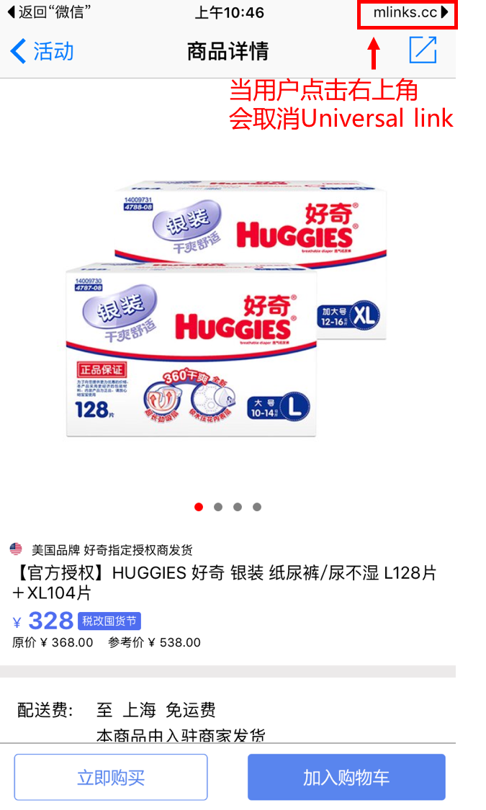
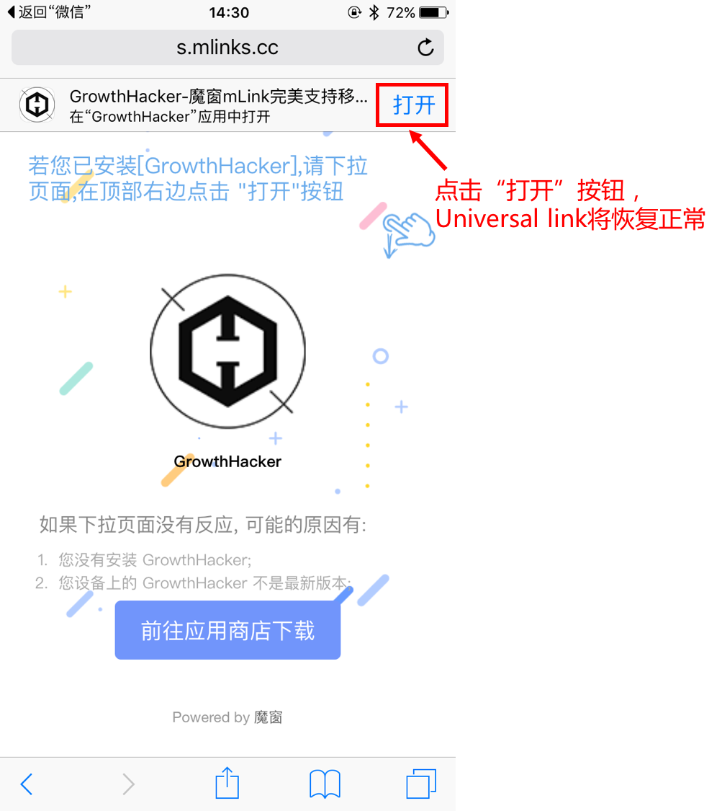
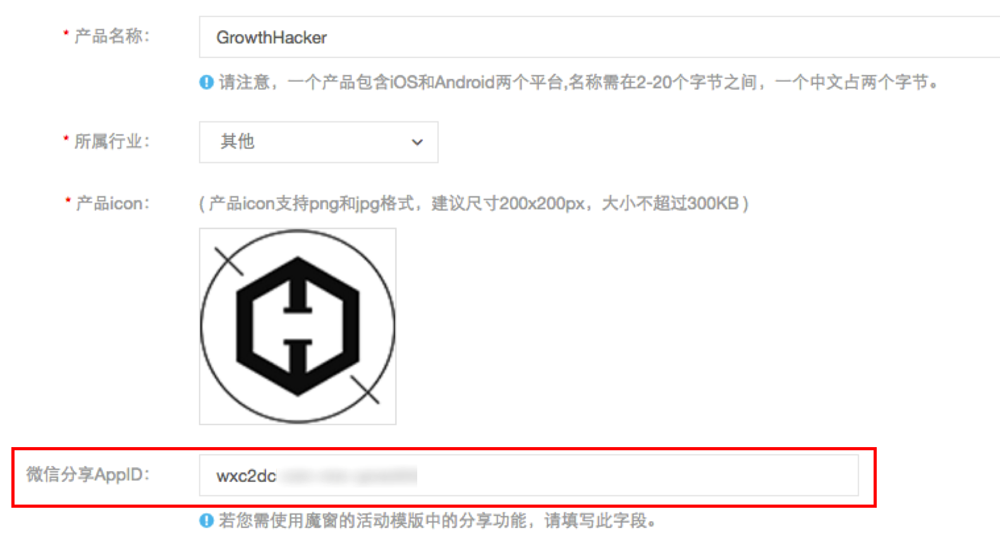
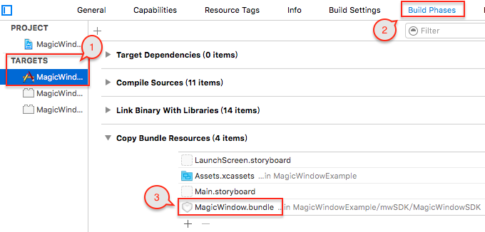

#魔窗iOS SDK FAQ

FAQ分类
---
* [Universal link](https://github.com/magicwindow/mw-sdk-faq/blob/master/ios-sdk-faq.md#universal-link)

Universal link
===
###Q1.mLink和App都配置了Universal link，但是无法从微信跳转到App？

(1)确认设备系统是iOS9以上,Universal link仅支持iOS9以上

(2)是否被用户手动取消

当使用Universal link打开App之后，右上角会出现“mlinks.cc”,点击右上角会取消Universal link

在Safari中打开链接，会出现smart banner，点击“打开”按钮，Universal link将恢复正常

(3)Team ID 是否填写正确

如下图，Team ID 和 Prefix正常情况下值都是一样的，当两处的值不一样的时候，优先使用Prefix

(4)自动打包和手动打包

使用xcodebuild自动打包会影响Universal link的使用，请使用手动打包

###Q2.在编辑Associated Domains 的时候，报错，错误信息“An App ID with Identifier ‘com.XXX’ is not available”，怎么解决？

进入苹果开发者帐号，将当前App ID 的Associated Domains 设置成Enable，如下图：

####Q3.什么是URL Scheme，怎么配置
OS系统中 App之前是相互隔离的，通过URL Scheme，App之间可以相互调用，并且可以传递参数。

在Xcode中，选中Target－Info－URL Types。比如填写magicWindow 在手机浏览器中输入 URL Scheme:// （比如 magicWindow://），如果可以唤起App，说明该URL Scheme 配置成功。

可以参考：<http://www.magicwindow.cn/doc/#uri-scheme>

####Q4.在Debug下测试正常，但是在Release下不能正常一键唤起
(1)后台配置的Team ID是否和App的编译证书相匹配

(2)update 相应的provisioning Profiles

####Q5.微信分享，登录或者支付不能正常使用
请在App管理中填写正确的微信AppID（前往微信开放平台申请微信AppID，<https://open.weixin.qq.com>）

####Q6.通过短链进入具体页面后，清除数据再次打开App，依旧进入短链对应的具体页面。

程序安装后第一次打开，魔窗mLink会跟后台通信实现场景还原。App清除数据后，mLink会判断程序为第一次安装。此时请求后台并匹配成功。所以会进入具体页面。

用户实际使用时基本不会发生此类情况。属于极小概率事件。

####Q7.在微信中点击短链接唤起App，在App中收到的动态参数的值不正确

可能是微信缓存造成的，退出微信登录，重新登录微信点击短链接

####Q8.短链内的参数值能动态修改么？
可以，短链支持将参数的动态值作为 query 放在后面

例如:http://a.t.mlinks.cc/ANax?id=12345

####Q9.App Store提审时，对Advertising Identifier（IDFA）的配置

SDK中使用了IDFA，App在往AppStore提审的时候，需要勾选以下选项

（1）Serve advertisements within the app

服务app中的广告。如果你的app中集成了广告，你需要勾选这一项。

（2）Attribute this app installation to a previously served advertisement

跟踪广告带来的安装。

（3）Attribute an action taken within this app to a previously served advertisement

跟踪广告带来的用户的后续行为。

（4）Limit Ad Tracking setting in iOS

这一项下的内容其实就是对你的app使用idfa的目的做下确认，只要你选择了采集idfa，那么这一项都是需要勾选的。

####Q10.手动在工程中添加SDK，初始化SDK的时候出现crash
在AppDelegate中调用registerApp方法，初始化SDK的时候，出现crash信息，请确认是否将整个的SDK包都放到了整个工程中，并且确认MagicWindow.bundle是否成功加入到了相应的target中

**建议使用Cocoapods集成SDK**

####Q11.一键唤起成功，场景还原失败
点击短链接的时间和安装App，第一次打开App的时间在60分钟之内，就会场景还原，（默认60分钟，时间可以在后台进行更改）。

点击短链接一键唤起成功的话，场景还原失败的话，需要debug看下，是否受到了App启动页或者引导页的影响。

场景还原和一键唤起的时候，都会走registerMLinkHandlerWithKey:(nonnull NSString *)key handler:(CallBackMLink)handler这个方法。
